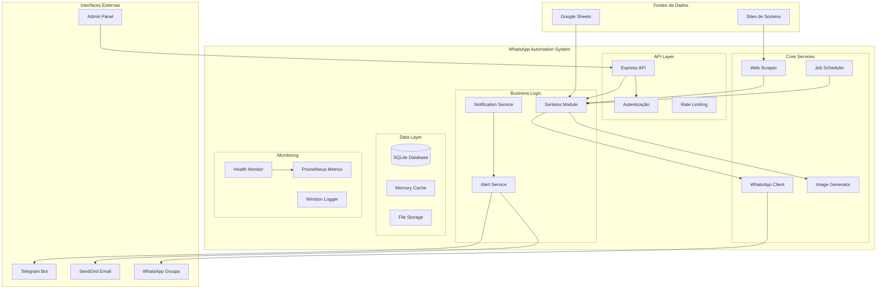
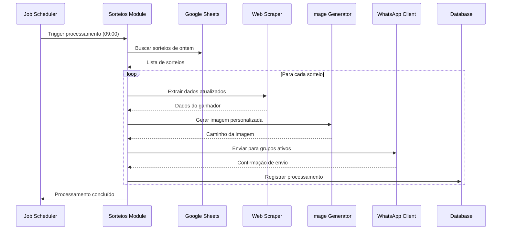
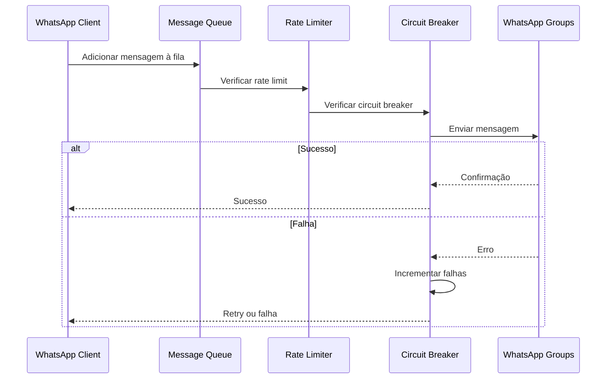
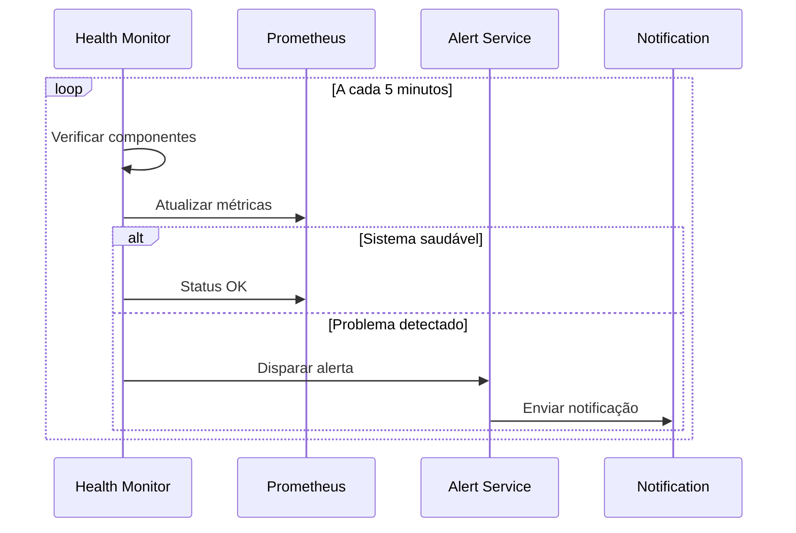
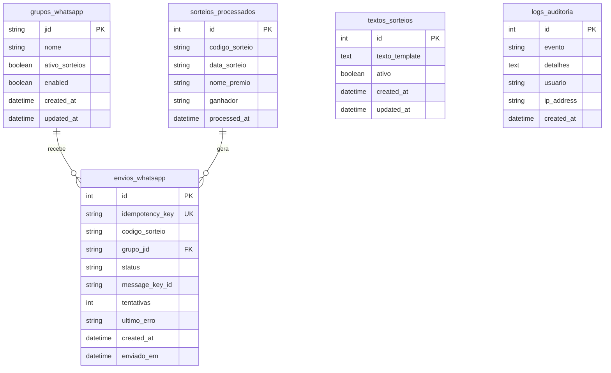
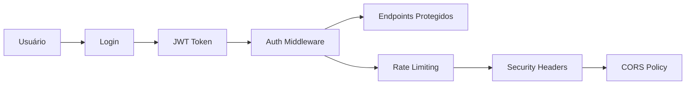
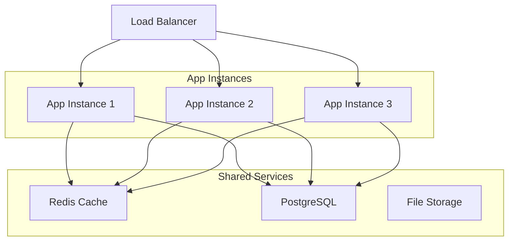

# 🏗️ Arquitetura do Sistema - WhatsApp Automation

Documentação técnica detalhada da arquitetura, componentes e fluxos do sistema.

## 📋 Índice

- [Visão Geral](#-visão-geral)
- [Arquitetura de Alto Nível](#-arquitetura-de-alto-nível)
- [Componentes Principais](#-componentes-principais)
- [Fluxos de Dados](#-fluxos-de-dados)
- [Banco de Dados](#-banco-de-dados)
- [Segurança](#-segurança)
- [Performance](#-performance)
- [Escalabilidade](#-escalabilidade)

## 🎯 Visão Geral

O WhatsApp Automation é um sistema distribuído baseado em Node.js que automatiza o processamento e envio de resultados de sorteios via WhatsApp. O sistema foi projetado com foco em:

- **Confiabilidade**: Circuit breakers, retry automático, idempotência
- **Observabilidade**: Logs estruturados, métricas, health checks
- **Manutenibilidade**: Arquitetura modular, separação de responsabilidades
- **Escalabilidade**: Design stateless, processamento assíncrono

## 🏛️ Arquitetura de Alto Nível



## 🔧 Componentes Principais

### 1. API Layer

#### Express API (`src/app.js`)
- **Responsabilidade**: Servidor HTTP principal
- **Funcionalidades**:
  - Roteamento de requisições
  - Middleware de segurança (Helmet, CORS)
  - Compressão de respostas
  - Tratamento de erros global

```javascript
// Estrutura principal
app.use(helmet());
app.use(cors());
app.use(compression());
app.use(express.json());
app.use(rateLimiter);
app.use('/admin', adminRoutes);
app.use('/api', apiRoutes);
```

#### Autenticação (`src/middleware/auth.js`)
- **Estratégia**: JWT + Sessões
- **Proteção**: Endpoints administrativos
- **Features**: Rate limiting por IP

### 2. Core Services

#### Job Scheduler (`src/services/job-scheduler.js`)
- **Engine**: node-cron
- **Jobs Configurados**:
  - `sorteios-diarios`: 09:00 (processamento principal)
  - `limpeza-diaria`: 00:00 (cleanup de dados)
  - `health-check`: */5 min (monitoramento)

```javascript
// Configuração de jobs
const jobs = {
  'sorteios-diarios': {
    cron: '0 9 * * *',
    handler: () => sorteiosModule.processarSorteiosDiarios()
  }
};
```

#### WhatsApp Client (`src/services/whatsapp-client.js`)
- **Biblioteca**: @whiskeysockets/baileys
- **Features**:
  - Reconexão automática
  - Queue de mensagens
  - Circuit breaker
  - Rate limiting (30s entre envios)

```javascript
// Arquitetura do cliente
class WhatsAppClient {
  constructor() {
    this.sock = null;
    this.messageQueue = [];
    this.circuitBreaker = new CircuitBreaker();
    this.rateLimiter = new RateLimiter(30000); // 30s
  }
}
```

#### Web Scraper (`src/services/scraper.js`)
- **Engine**: Axios + Cheerio
- **Estratégias**:
  - User-Agent rotation
  - Retry com backoff exponencial
  - Timeout configurável
  - Cache de resultados

#### Image Generator (`src/services/image-generator.js`)
- **Engine**: Puppeteer
- **Funcionalidades**:
  - Templates HTML dinâmicos
  - Renderização server-side
  - Otimização de imagens
  - Cache de browser reutilizável

### 3. Business Logic

#### Módulo de Sorteios (`src/modules/sorteios.js`)
- **Responsabilidade**: Orquestração do processo principal
- **Fluxo**:
  1. Buscar sorteios na planilha
  2. Fazer scraping dos dados
  3. Gerar imagem personalizada
  4. Enviar para grupos ativos
  5. Registrar logs de auditoria

```javascript
// Fluxo principal
async processarSorteio(codigo) {
  const dados = await this.googleSheets.buscarSorteio(codigo);
  const dadosAtualizados = await this.scraper.extrairDados(dados.url);
  const imagePath = await this.imageGenerator.gerar(dadosAtualizados);
  await this.whatsapp.enviarParaGrupos(dadosAtualizados, imagePath);
  await this.registrarProcessamento(codigo, dadosAtualizados);
}
```

### 4. Data Layer

#### SQLite Database (`src/config/database.js`)
- **Engine**: sqlite3 + sqlite
- **Configuração**: WAL mode, foreign keys habilitadas
- **Backup**: Automático via triggers
- **Migrations**: Sistema próprio de versionamento

#### Schema Principal

```sql
-- Grupos WhatsApp
grupos_whatsapp (jid, nome, ativo_sorteios, enabled)

-- Sorteios processados
sorteios_processados (codigo_sorteio, data_sorteio, ganhador, processed_at)

-- Envios WhatsApp
envios_whatsapp (codigo_sorteio, grupo_jid, status, tentativas)

-- Logs de auditoria
logs_auditoria (evento, detalhes, usuario, created_at)
```

### 5. Monitoring & Observability

#### Prometheus Metrics (`src/services/metrics.js`)
- **Métricas Coletadas**:
  - `wa_auto_messages_sent_total`: Mensagens enviadas
  - `wa_auto_messages_failed_total`: Falhas no envio
  - `wa_auto_baileys_connection_state`: Estado da conexão
  - `wa_auto_job_processing_seconds`: Duração dos jobs

#### Winston Logger (`src/config/logger.js`)
- **Níveis**: error, warn, info, debug
- **Transports**: Console + File rotation
- **Formato**: JSON estruturado com timestamps

#### Health Monitor (`src/services/health-monitor.js`)
- **Verificações**:
  - Database connectivity
  - WhatsApp connection
  - Memory usage
  - Disk space
  - External APIs

## 🔄 Fluxos de Dados

### 1. Fluxo Principal (Processamento Diário)



### 2. Fluxo de Envio WhatsApp



### 3. Fluxo de Monitoramento



## 🗄️ Banco de Dados

### Modelo de Dados



### Índices de Performance

```sql
-- Índices principais para otimização
CREATE INDEX idx_grupos_ativo_sorteios ON grupos_whatsapp(ativo_sorteios);
CREATE INDEX idx_sorteios_codigo ON sorteios_processados(codigo_sorteio);
CREATE INDEX idx_envios_status ON envios_whatsapp(status);
CREATE INDEX idx_envios_created_at ON envios_whatsapp(created_at);
CREATE INDEX idx_logs_evento ON logs_auditoria(evento);
```

### Estratégias de Backup

1. **WAL Mode**: Permite leituras concorrentes
2. **Triggers**: Backup automático em mudanças críticas
3. **Snapshots**: Backup diário via cron
4. **Retenção**: 30 dias de logs, 90 dias de dados

## 🔒 Segurança

### Autenticação e Autorização



### Medidas de Segurança

1. **Headers de Segurança**: Helmet.js
2. **Rate Limiting**: Por IP e endpoint
3. **Input Validation**: Joi schemas
4. **SQL Injection**: Prepared statements
5. **XSS Protection**: Content Security Policy
6. **HTTPS**: Obrigatório em produção

### Configuração de Segurança

```javascript
// Helmet configuration
app.use(helmet({
  contentSecurityPolicy: {
    directives: {
      defaultSrc: ["'self'"],
      styleSrc: ["'self'", "'unsafe-inline'"],
      scriptSrc: ["'self'"],
      imgSrc: ["'self'", "data:", "https:"]
    }
  }
}));

// Rate limiting
const limiter = rateLimit({
  windowMs: 15 * 60 * 1000, // 15 minutos
  max: 100, // máximo 100 requests por IP
  message: 'Muitas requisições deste IP'
});
```

## ⚡ Performance

### Otimizações Implementadas

1. **Connection Pooling**: SQLite com pool de conexões
2. **Caching**: Cache em memória para dados frequentes
3. **Compression**: Gzip para respostas HTTP
4. **Lazy Loading**: Carregamento sob demanda
5. **Batch Processing**: Processamento em lotes

### Métricas de Performance

```javascript
// Monitoramento de performance
const performanceMetrics = {
  responseTime: histogram({
    name: 'http_request_duration_seconds',
    help: 'Duração das requisições HTTP'
  }),
  
  memoryUsage: gauge({
    name: 'nodejs_memory_usage_bytes',
    help: 'Uso de memória do Node.js'
  }),
  
  dbQueryTime: histogram({
    name: 'database_query_duration_seconds',
    help: 'Duração das queries do banco'
  })
};
```

### Benchmarks

- **Tempo de resposta API**: < 200ms (95th percentile)
- **Processamento de sorteio**: < 30s (incluindo scraping)
- **Geração de imagem**: < 5s
- **Envio WhatsApp**: < 10s por grupo

## 📈 Escalabilidade

### Limitações Atuais

1. **SQLite**: Adequado para cargas médias
2. **Single Instance**: Não há clustering
3. **File Storage**: Armazenamento local
4. **WhatsApp Session**: Uma sessão por instância

### Estratégias de Escala

#### Escala Vertical (Render.com)
```yaml
# render.yaml
services:
  - type: web
    name: whatsapp-automation
    env: node
    plan: standard # Upgrade do plano
    envVars:
      - key: NODE_ENV
        value: production
```

#### Escala Horizontal (Futuro)


### Pontos de Melhoria

1. **Database**: Migração para PostgreSQL
2. **Cache**: Implementação Redis
3. **File Storage**: Migração para S3/CloudFlare
4. **Queue System**: Bull/Agenda para jobs
5. **Monitoring**: Grafana + Prometheus
6. **Logging**: ELK Stack

## 🔧 Configuração de Ambiente

### Variáveis de Ambiente

```bash
# Core
NODE_ENV=production
PORT=3000
JWT_SECRET=super-secret-key

# Database
DATABASE_PATH=./data/database.sqlite

# Google Sheets
GOOGLE_SHEETS_ID=planilha-id
GOOGLE_SHEETS_CREDENTIALS={"type":"service_account"...}

# WhatsApp
WHATSAPP_SESSION_PATH=./data/whatsapp-session
WHATSAPP_RETRY_ATTEMPTS=3

# Monitoring
METRICS_ENABLED=true
LOG_LEVEL=info

# Alertas
SENDGRID_API_KEY=sg-key
TELEGRAM_BOT_TOKEN=bot-token
```

### Configuração de Produção

```javascript
// Configurações específicas para produção
const productionConfig = {
  database: {
    pragma: {
      journal_mode: 'WAL',
      synchronous: 'NORMAL',
      cache_size: -64000, // 64MB
      temp_store: 'MEMORY'
    }
  },
  
  whatsapp: {
    retryAttempts: 3,
    retryDelay: 5000,
    circuitBreakerThreshold: 5
  },
  
  jobs: {
    concurrency: 1,
    maxRetries: 3
  }
};
```

## 📊 Monitoramento e Observabilidade

### Dashboard de Métricas

```javascript
// Métricas principais expostas
const metrics = {
  // Contadores
  messagesSent: counter('messages_sent_total'),
  messagesFailed: counter('messages_failed_total'),
  
  // Gauges
  whatsappConnected: gauge('whatsapp_connected'),
  activeJobs: gauge('active_jobs_count'),
  
  // Histogramas
  jobDuration: histogram('job_duration_seconds'),
  apiResponseTime: histogram('api_response_time_seconds')
};
```

### Alertas Configurados

1. **WhatsApp Desconectado**: Imediato
2. **Job Falhando**: 3 falhas consecutivas
3. **API Lenta**: Response time > 5s
4. **Memória Alta**: > 80% do limite
5. **Disk Space**: < 10% livre

---

**Arquitetura v1.0.0** 🏗️

